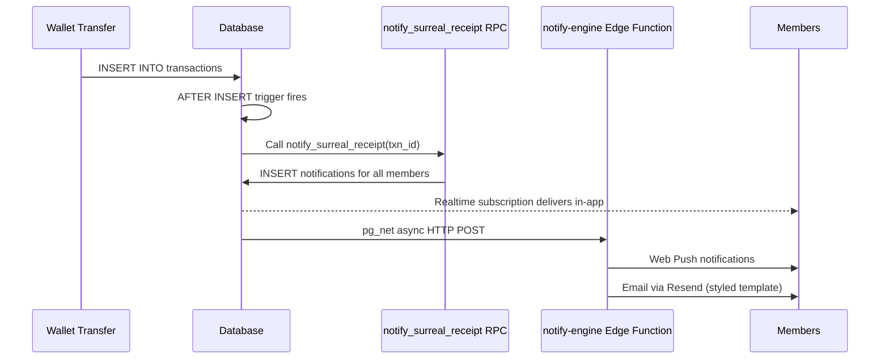

# Broadcast Surreal Notifications — Implementation Summary

## Overview
Applied the `broadcast-surreal-notifications` OpenSpec change to the `feature/surreal-engagement` branch. This feature broadcasts notifications to all community members when someone earns surreais, driving social engagement.

## Changes Made

### Database (already existed, enhanced)
| File | Change |
|------|--------|
| [RPC migration](file:///home/arpt2/git/robson/tekua-gov/supabase/migrations/20260816000000_create_surreal_receipt_notifications_rpc.sql) | ✅ Pre-existing — creates in-app notifications for all members |
| [Trigger migration](file:///home/arpt2/git/robson/tekua-gov/supabase/migrations/20260816000001_create_surreal_receipt_trigger.sql) | 🔧 **Enhanced** — now also dispatches async `pg_net` call to `notify-engine` for push + email |
| [Data column migration](file:///home/arpt2/git/robson/tekua-gov/supabase/migrations/20260816000002_add_notifications_data_column.sql) | ✅ Pre-existing — adds `data JSONB` to notifications |

### Backend (Edge Functions)
| File | Change |
|------|--------|
| [notify-engine](file:///home/arpt2/git/robson/tekua-gov/supabase/functions/notify-engine/index.ts) | 🆕 Added `notification.surreal_receipt` event handler with styled email template |

> [!IMPORTANT]  
> The notify-engine skips in-app notification creation for surreal_receipt events (the DB trigger already does this), and only handles push + email delivery.

### Frontend
| File | Change |
|------|--------|
| [Notifications.tsx](file:///home/arpt2/git/robson/tekua-gov/src/pages/Notifications.tsx) | 🔧 Added `surreal_receipt` type with `Coins` icon + `secondary` color |
| [NotificationContext.tsx](file:///home/arpt2/git/robson/tekua-gov/src/context/NotificationContext.tsx) | 🔧 Added `data` field to `Notification` interface |
| [PT translations](file:///home/arpt2/git/robson/tekua-gov/src/locales/pt/translation.json) | 🆕 Added `shareSurreal.*` + `notifications.*` keys |
| [EN translations](file:///home/arpt2/git/robson/tekua-gov/src/locales/en/translation.json) | 🆕 Added `shareSurreal.*` + `notifications.*` keys |

### Pre-existing (untouched)
- `ShareSurrealLanding.tsx` — public receipt page ✅
- `api-public/getShareSurrealReceipt` — public API action ✅  
- Router `/share/surreal/:shareId` — route config ✅
- `ShareSurrealLanding.test.tsx` — test file ✅

## Architecture Flow

## Remaining Tasks
- **Section 5 (Testing)**: Integration tests for full transaction → notification flow
- **Section 6 (Rollout)**: Staging verification, rollback plan, production deploy
